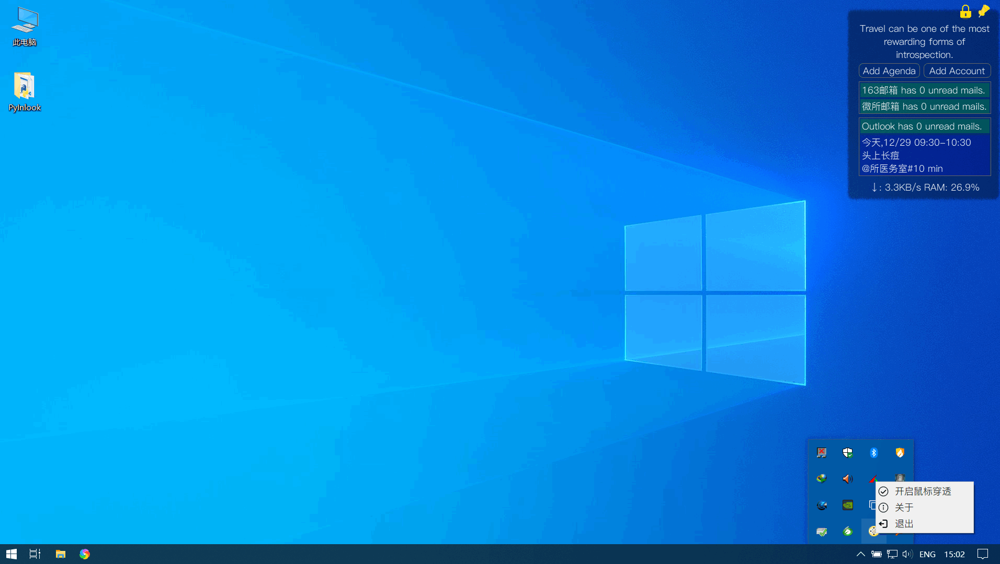

# Inlook - Your personal assistant

[中文版](https://github.com/charleechan/Inlook/blob/main/Readme_CN.md)|English version

## Introduction
Inlook is developed to visually remind users of unread mail and schedule on the desktop. The release is distributed only on windows 10. Developers in need can freely develop versions of other platforms based on this project.

## [User Guide](https://charleechan.github.io/Github_Gitbook_Cnblogs/inlook.html)

Screen Shot

## Release

* [Click Me To Download The Release Version](https://pan.baidu.com/s/1gzzFjWwLh1hMKob9biTz0g) (a1b2)
* 1.0.0.1 Add support for Chinese, fix some bugs.
* 1.0.0.0 Initial release

## Features

* Pop up reminder when new mail arrives.
* List the schedule from yesterday to the next 6 days.
* Lock/Unlock the window position and window size.
* The window is placed at the bottom of other windows, which does not affect the work.
* Network speed and RAM occupancy monitor.
* Support mouse penetration, so you can work at ease.

## Change log
* 2020.12.29 Initial release
* 2021.01.15 Add support for Chinese, fix some bugs.
* 2020.01.18 Fix the bug: break down when reconnect after disconnecting network.

## Contact

charleechan@163.com

## Declaration of interest

[GNU General Public License v3.0]

## Usage

* Run at startup: Create a shortcut of **start.bat** and move it into folder `C:\Users\[username]\AppData\Roaming\Microsoft\Windows\Start Menu\Programs\Startup`.
* Change the language whenever you want in **Tray Menu**.